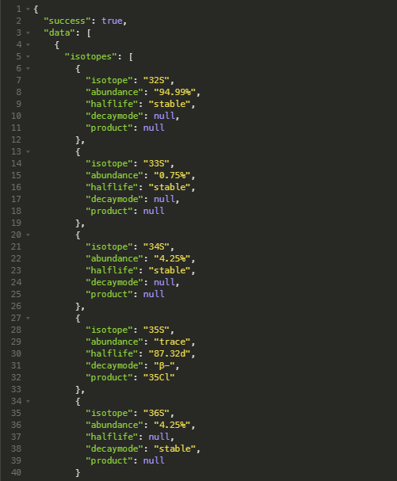

# Elementium
An api gives information about elements.
## An Element searching API.

### API Routes

#### /api/element

    /api/element?querytype=something&field=somethingelse

#### Querytype:
* name
* group
* sign
* period
* block
* atomno

#### Fields:
* general
* physical
* atomic
* misc
* history
* isotope

### Sample Queries

#### Search by name:
    api/element?name=helium&field=atomic
#### Returns:

### Search by sign:
    api/element?sign=S&field=isotopes

